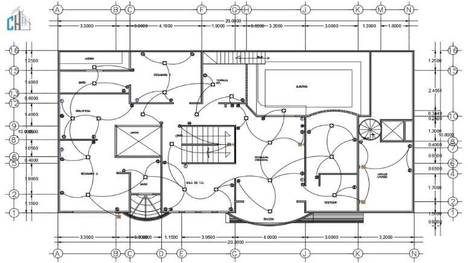

As a Diploma Electrical Engineering student, learning design software like AutoCAD Electrical is essential for modern electrical work.

In this post, I am sharing a **complete setup package with video guide** to help beginners get started easily.

## 🔽 Download Link

You can access the full setup package (software + video tutorial) from the link below:

👉 https://drive.google.com/drive/folders/1EP07gpQjvh19ln6IGjno-kQ1URv7Cx_N?usp=sharing

📁 Folder Includes:
- AutoCAD Electrical 2024 setup files  
- Installation video tutorial  
- Setup instructions  

## 🎥 Installation Guide (Video)

Inside the folder, you will find a step-by-step video that covers:

1. Software installation process  
2. Setup configuration  
3. First-time launch  

## ⚙️ System Requirements

- OS: Windows 10 / 11 (64-bit)  
- RAM: Minimum 8GB (16GB recommended)  
- Storage: 10GB free space  
- Processor: Intel Core i5 or higher  

## 🔧 What You Can Do With AutoCAD Electrical

- Electrical schematic design  
- Panel layout drawing  
- Wiring diagram creation  
- Industrial automation planning  

## ⚠️ Important Note

Before installing any third-party software package, always ensure:
- Your antivirus is active  
- Files are scanned properly  
- You understand the installation steps  

Because modified or unofficial software packages may contain security risks.

## 🚀 Learning Goal

My goal is to combine:
- AutoCAD Electrical design skill  
- Real field wiring experience  

To become a skilled electrical professional in Bangladesh.

Start learning and practicing — consistency is the key.