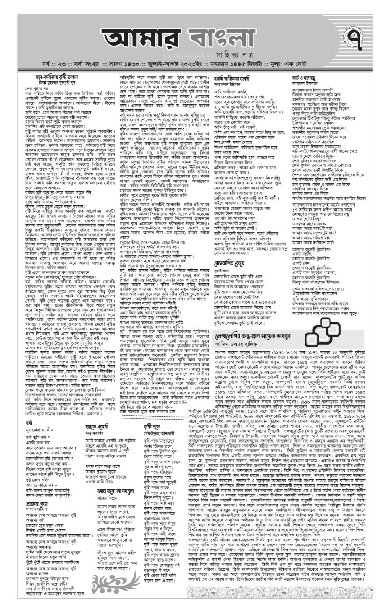
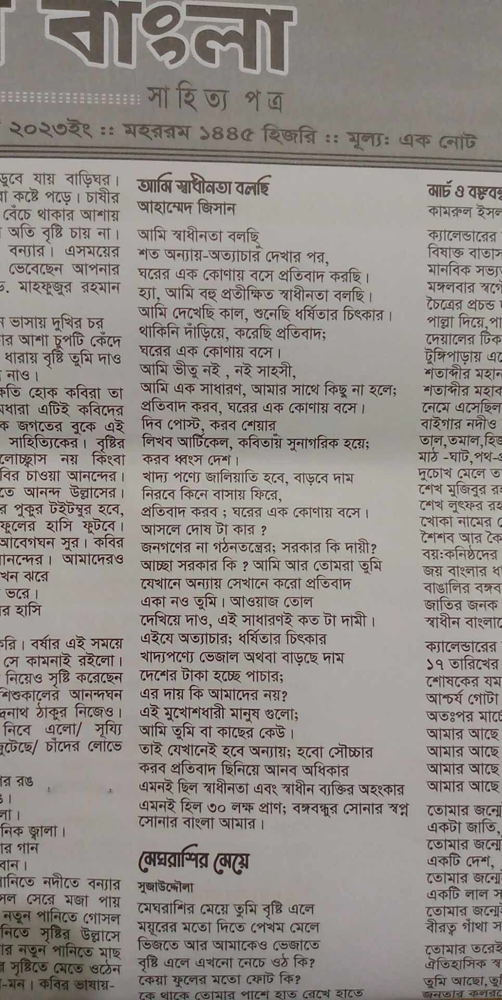

## 📰 আমার কবিতা পত্রিকায় প্রকাশিত — “আমি স্বাধীনতা বলছি”

একটা বিশেষ মুহূর্ত শেয়ার করতে চাই…

আমার লেখা কবিতা **“আমি স্বাধীনতা বলছি”** প্রকাশিত হয়েছিল **জুলাই ২০২৩**-এ, **দৈনিক আমার বাংলা** পত্রিকায়। এটা আমার জন্য অনেক বড় একটা অর্জন এবং গর্বের বিষয়।

## 📖 কবিতার ভাবনা

এই কবিতায় আমি স্বাধীনতার কথা বলেছি—  
কিন্তু শুধু ইতিহাসের স্বাধীনতা না,  
বরং বর্তমান সমাজের অন্যায়, নীরবতা এবং প্রতিবাদের কথাও তুলে ধরার চেষ্টা করেছি।

## ✍️ আমার অনুভূতি

ছোটবেলা থেকে লেখালেখির প্রতি আগ্রহ ছিল,  
কিন্তু নিজের লেখা print আকারে দেখতে পাওয়া — সত্যিই অন্যরকম অনুভূতি।

## 🚀 What's Next

এই যাত্রা এখানেই শেষ না—  
লেখালেখি এবং নিজের skill development—দুইটাই একসাথে এগিয়ে নিতে চাই, In Sha Allah।

সবাই দোয়া রাখবেন 🤍